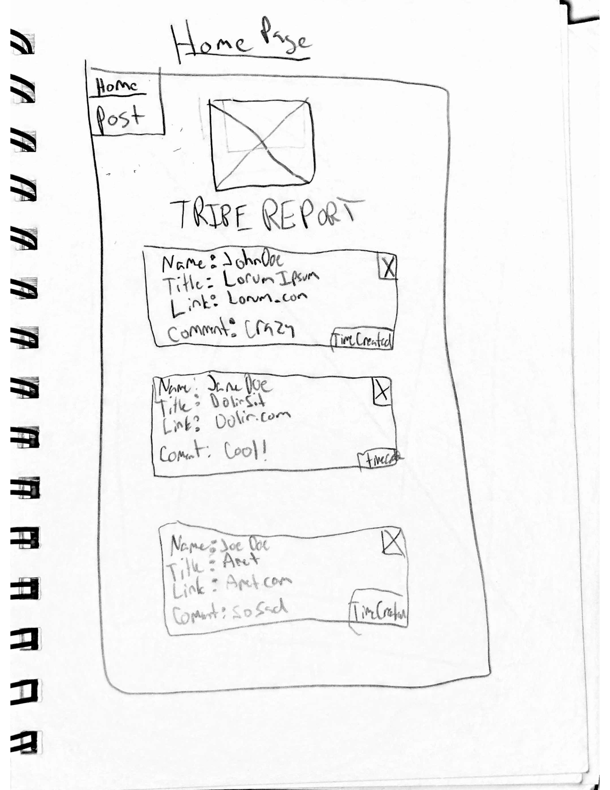
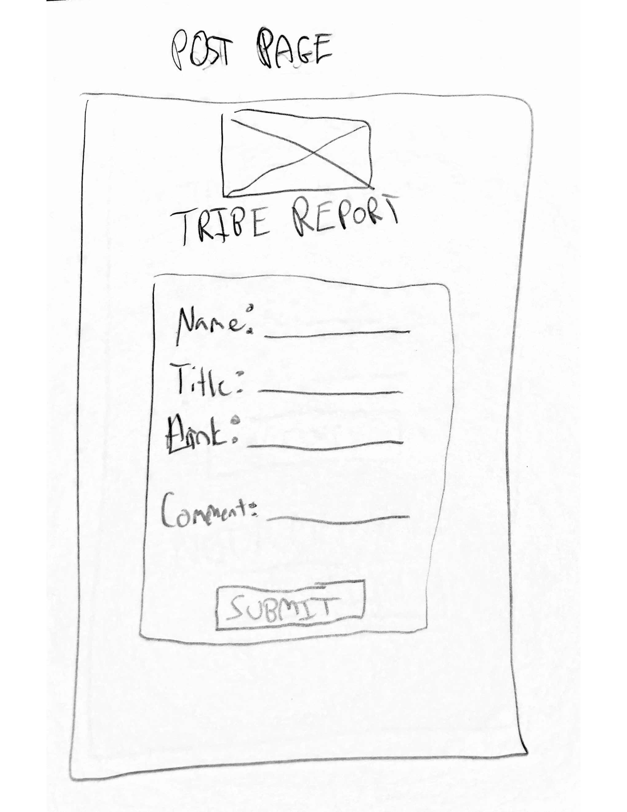
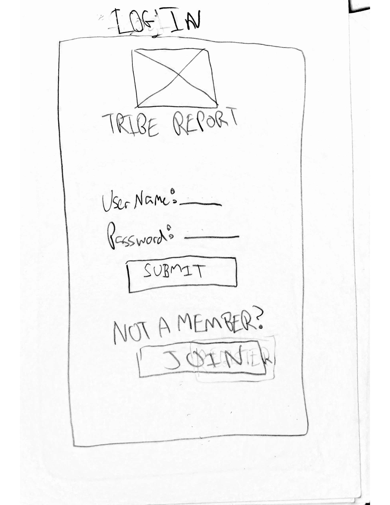
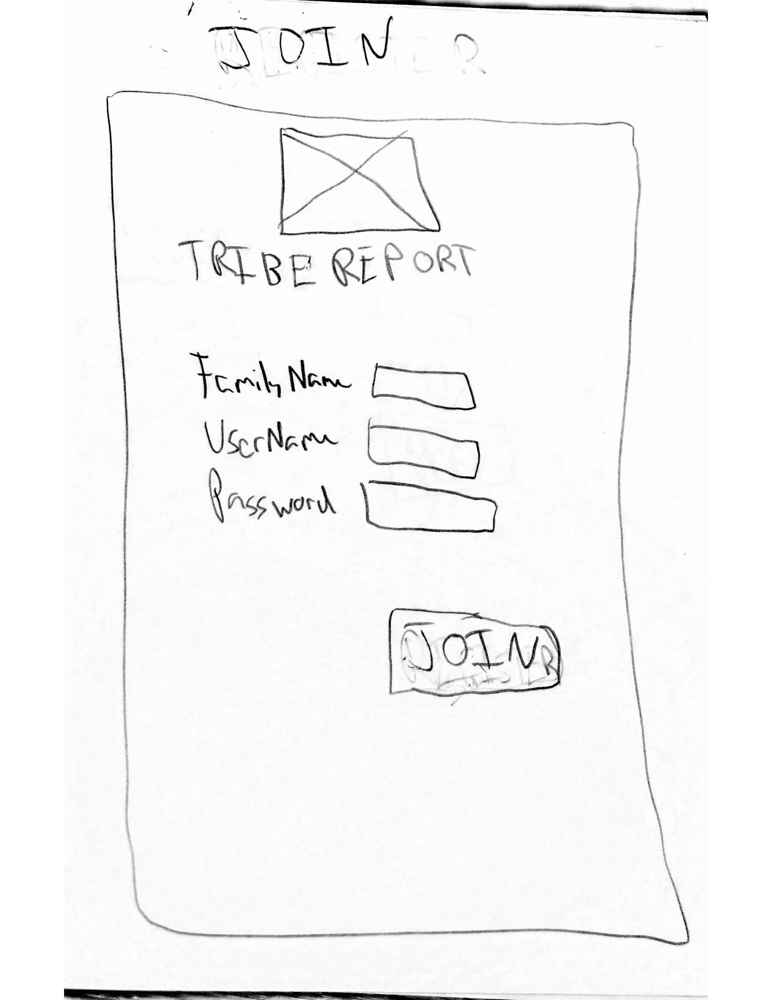
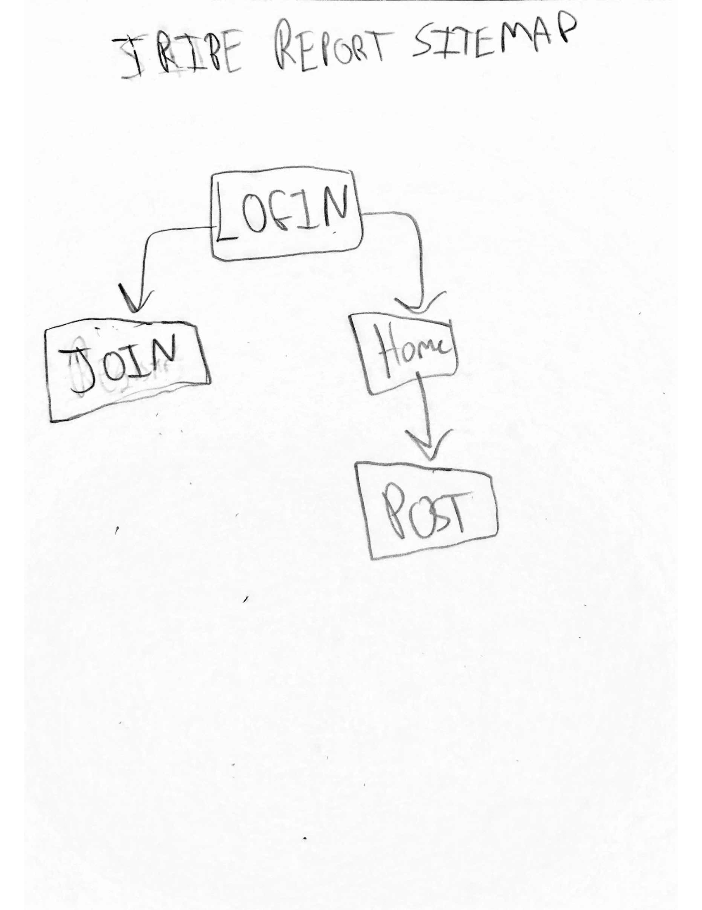

# Tribe Report

## Overview

Everytime you read something interesting, don't you always think to send it over to pops or your big bro. Even maybe your granddaddy. Sometimes they will take a look and sometimes it will get lost in cyber space due to various reasons. The tribe report will help allievate this issue.

Tribe report is a web app that will allow families to keep record of interesting articles they have read online. The family 'chief' will register for a tribe account (similar to having a family amazon or netflix account). Each tribe memeber will be able to login using the tribes credentials. Once in they can fill out a form to add their article findings and there will be a feed of the posts. After a month of the article being posted it will automatically be deleted from the Tribe Report feed.

## Data Model


The application will store Users and their respected articles 

* users can have multiple articles listed 

An Example User:

```javascript
{
  username: "DoesFam",
  hash: // a password hash,
  articles: [
    { name: "Jane Doe", Title: "Lorum ipsum", Article: "LorumImpsum.com", Comment:"Crazy world we live in"},
    { name: "John Doe", Title: "Dolor sit", Article: "DolorSit.com", Comment:"Go Mets!"},
  ],
  createdAt: // timestamp
}
```


## [Link to Commented First Draft Schema](db.js) 


## Wireframes

/home - home page with feed of the articles



/post - page to add new articles



/ - page to log in



/join - page to join



## Site map




## User Stories or Use Cases


1. as non-registered user, I can register a new account with the site
2. as a user, I can log in to the site
3. as a user, I can post  news article I want to share with the account I am logged in (tribe account)
4. as a user, I can view all of the shared articles that have been created on the account I am logged in(tribe account)
5. as a user, I can delete articles I don't find relavant anymore on the 
account I am logged in (trust in tribe account members)

## Research Topics

(2 points) Use a CSS framework throughout your site, use a reasonable of customization of the framework (don't just use stock Bootstrap - minimally configure a theme):
  * Bootstrap is a responsive front-end framework for designing websites and web applications. It allows the layout of the Web pages to be adjusted dynamically, depending upon the characteristics of the device used – whether it is a desktop, mobile phone or tablet. As mobile phones are only growing people tend to use their phone in substitute of a computer so I think it is important to have the app be responsive.(2,3)
(3 points) Perform client side form validation using custom JavaScript or JavaScript library
  * URI validation functions to make sure links to articles are valid. It collects common URI validation routines to make input validation, and untainting easier and more readable. All functions return an untainted value if the test passes, and undef if it fails, making it simple. This will help so when the link is hovered over the live preview performed will work smoothly.

(5 points) Integrate user authentication
  * Passport for user authentication. As each tribe needs their atricles to be perserved user authentication is the very important. Without user authentication, the user cannot experience the functionalilies of the application. Depending on time constraints may vamp up this feature


  
10 points total out of 8 required points 


## [Link to Initial Main Project File](app.js) 


## Annotations / References Used


1. [URI validation functions docs](https://www.npmjs.com/package/valid-url) - (app.js)
2. [tutorial on bootstrap + express.js](https://opensourceforu.com/2016/10/build-website-using-bootstrap-express-js/)
3. [bootstrap docs](https://www.npmjs.com/package/bootstrap )
4. [Professors sample](https://github.com/nyu-csci-ua-0480-008-spring-2017/final-project-example)-(app.js,db.js)
5. [passport docs](http://www.passportjs.org/docs/)-(app.js)